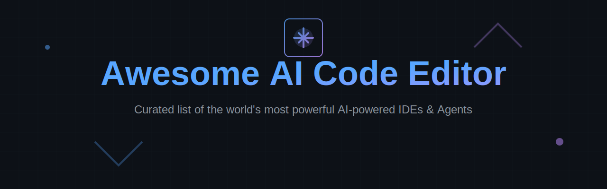

# 🚀 Awesome AI Code Editor
### The Ultimate Curated List of AI-Powered IDEs, Agents & Coding Ecosystems

**Transforming the way developers write, debug, and deploy code with Agentic AI.**

[SaaS Platforms](#-saas-products) • [Open-Source Projects](#-open-source-github-projects) • [Contributing](#-how-to-contribute) • [Star History](#-star-history)

---

## 📖 Introduction

Welcome to the most comprehensive and up-to-date repository for **AI Code Editors** and **Agentic Development Environments**. As of **2026**, the coding landscape has shifted from simple "copilots" to fully autonomous **AI Software Engineers** and deeply integrated **AI-native IDEs**.

This list tracks the best **SaaS platforms** and **Open-Source GitHub projects** that empower developers with:
- 🧠 **Deep Codebase Understanding**: Multi-file indexing and semantic search.
- 🤖 **Agentic Capabilities**: Autonomous task execution and planning.
- 💬 **Natural Language Editing**: Describe changes, and the AI executes them.
- 🛠️ **Local LLM Support**: Privacy-first coding with Ollama, LM Studio, etc.

---

## 🏆 SaaS Products

### 💎 Core Platforms (AI Code Editors & Agents)

| Tool | Description | Highlights |
| :--- | :--- | :--- |
| **[Cursor](https://cursor.com/)** | The gold standard for AI-first editors. | VS Code fork, codebase indexing, Composer mode. |
| **[Windsurf](https://windsurf.com/)** | High-velocity AI IDE by Codeium. | Flow state, agentic reasoning, deep integration. |
| **[Devin](https://www.cognition.ai/devin)** | The world's first autonomous AI software engineer. | Plans, executes, and fixes bugs independently. |
| **[Magic](https://magic.dev/)** | LTM-1 powered IDE with massive context. | 100M+ token context window. |
| **[Void IDE](https://void.dev/)** | Modern AI-native editor focused on privacy. | Fast, local-friendly, seamless UX. |
| **[PearAI](https://pear.ai/)** | Open-core AI editor for modern workflows. | Developer-centric, extensible agents. |
| **[Trae](https://trae.ai/)** | Adaptive AI coding assistant. | Advanced reasoning, project-level intelligence. |
| **[Replit Agent](https://replit.com/)** | Build and deploy apps via chat. | Fully integrated cloud environment. |
| **[Claude Code](https://claude.ai/)** | Anthropic's power-user coding interface. | Superior reasoning, large context handling. |

### 🛠️ Advanced & Specialized Tools

- **[Amazon Q Developer](https://aws.amazon.com/q/developer/)**: AWS-native agentic features and automated upgrades.
- **[Supermaven](https://supermaven.com/)**: Ultra-fast (low latency) with 1M token context.
- **[Cosine](https://cosine.sh/)**: Deep codebase indexing for high-fidelity context.
- **[GitHub Copilot Workspace](https://github.com/features/copilot)**: Plan-first development within GitHub.

---

## 📂 Open-Source GitHub Projects

### 🌟 Top Dedicated AI Editors & Agents

- **[Continue](https://github.com/continuedev/continue)** 🛠️  
  The leading open-source autopilot. Supports Ollama, local models, and custom workflows in VS Code/JetBrains.
- **[Aider](https://github.com/paul-gauthier/aider)** ⌨️  
  CLI-based AI pair programmer. Edits files directly in your Git repo. Best-in-class for terminal users.
- **[Zed](https://github.com/zed-industries/zed)** ⚡  
  High-performance Rust-based editor with native AI capabilities. Blazing fast.
- **[Gemini CLI](https://github.com/google/gemini-cli)** 🤖  
  Interactive CLI agent for autonomous software engineering with massive context integration.
- **[OpenHands](https://github.com/All-Hands-AI/OpenHands)** 👐  
  Community-driven autonomous AI software engineer (formerly OpenDevin).
- **[Melty](https://github.com/meltylabs/melty)** 🍦  
  First open-source AI editor that tracks changes across your entire stack.
- **[Plandex](https://github.com/plandex-ai/plandex)** 📝  
  Terminal-based agent for complex, multi-step tasks with sandboxed execution.
- **[Mentat](https://github.com/Mentat-AI/mentat)** 🧠  
  AI coding assistant that lives in your terminal and understands your project context.

### 🔬 Experimental & Specialized OS Tools

- **[Tabby](https://github.com/TabbyML/tabby)**: Self-hosted, private AI coding assistant.
- **[GPT Pilot](https://github.com/Pythagora-io/gpt-pilot)**: AI developer that builds production-ready apps from scratch.
- **[Sweep](https://github.com/sweepai/sweep)**: AI-powered GitHub App for automated issue fixing.
- **[Roo Code](https://github.com/RooVetGit/Roo-Code)**: Advanced agentic coding framework for VS Code.

---

## 🔍 Why Use AI Code Editors? (SEO)

As development complexity grows, **AI Code Editors** and **Agentic IDEs** provide a competitive edge. Unlike traditional editors, these tools are "aware" of your entire project structure, documentation, and logic.

### Key Benefits:
- **Reduced Cognitive Load**: Let the AI handle boilerplate and complex refactors.
- **Faster Onboarding**: AI helps explain legacy code and architectural patterns.
- **Autonomous Bug Fixing**: Agents can reproduce bugs and suggest verified fixes.
- **Privacy & Control**: Open-source tools like **Continue** and **Aider** allow for 100% local processing.

---

## 👋 How to Contribute

Contributions make the community awesome! Please follow these steps:

1. **Fork** the repository.
2. **Add/Update** the entry in `README.md`.
3. Ensure the description is **factual** and **concise**.
4. **Submit a PR** with a clear title.

[See full contributing guidelines](CONTRIBUTING.md)

---

## 📈 Star History

---

**[⬆ Back to Top](#-awesome-ai-code-editor)**

Made with ❤️ for the AI Developer Community.

<!-- SEO Meta Tags -->
<!-- 
Keywords: AI Code Editor, AI IDE, Agentic Coding, Best AI Code Editor 2026, Open Source AI Editor, Cursor vs Windsurf, Devin AI, Aider, Continue.dev, Local LLM Coding
Description: A curated list of the best AI-powered code editors, IDEs, and autonomous coding agents for developers. 
-->
